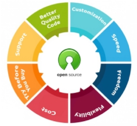

# IGI Approach to Self-Healing Systems

## Introduction

Automation is a key design principle in our DevOps implementation. In order to speed up throughput in
the software development life cycle (SDLC), Information Gateways, Inc (IGI) DevOps automates everything from builds to testing to monitoring. A common issue with automation is that most automated tasks are centered around a simple threshold or pass/fail criteria. This means DevOps can end up chasing false positive or not catching subtleties in the code that trips alarms later, typically in production.

To counter these issues, IGI DevOps builds and trains AI/ML models that enable the automated assessment of test results for far more complex criteria, such as defining thresholds based on statistical significance rather than presence/absence of specific criteria. All without slowing down the SDLC.

## Automation-First

When implemented correctly, automation can increase speed and accuracy, and can lift mundane operational tasks from the shoulders of developers. Adopting automation doesn’t just save the time – it also save the money.

## Open Source Solutions

One of the main reasons enterprise gravitate toward
proprietary vendors, despite the many advantages of
open source solutions, is that they’re more interested
in stability that accompanies the status quo than
seeking new and better options. Unfortunately, giving
into this mindset hampers innovation because closed
networks do not allow you to seek out alternate
solutions and options that are tailored to specific
needs. IGI recommends using open source solutions as a means to mitigate these risks.

## Contain Risk – Modular Approach

To make use of open source technology, IGI has learned to
manage the risk, rather to avoid it. One way to reduce risk is
to segment the systems into logical building blocks to
contain the growing pain of new technology. We call it "The
Lego Analogy". The key facets of this approach include the use of:

 

* Open Standards/Data
* Microservices
* Containers
* FaaS (Function as a Service)
* Events/Messages

## Prioritizing People
IGI’s adaptation of “automation first” attitude is evident in
the skills, talent and forward thinking of our employees. We
recommend in investing in talent which makes the magic
happen, instead of acquiring expensive closed systems which
promise to do everything.

## Self-Healing Systems

Another key concept of IGI DevOps is the implemenation of self-healing systems and IGI recommends a phased approach to building the ultimate adaptive self-healing system. The 4 stages of this process are show are shown in the figure below. 

**Stage I – Traditional:**
This stage implements the more traditional monitoring capability. This is a real-time feedback loop of system status monitoring and near real-time optimizations to fix the problems or improve performance.

* The sensory systems and the optimizations are based on human-made rules using simple descriptive analytics.
* These rules are easy to interpret, cannot adapt to changing environments, and lack the complexity to effectively deal with a wide range of possible solutions.

**Stage II - Predictive:**
Next, IGI develops predictive systems which find the patterns in past system data and use them to predict future behavior.

* Machine Learning models analyze the factors thought to be impactful, like time/day, system events or one-time or recurring external events or factors.
* These predictions give human overseers advanced warning of how to distribute system resources and perform other optimizations, leading to enhanced performance at lower cost.

**Stage III - Prescriptive:**
In this stage, IGI implements Prescriptive systems, where AI algorithms look beyond system data and initial guidance into external data sets such as generated and simulated data.

* Machine learning methods include deep learning, simulation techniques, advanced
statistics, model governance, and automatic model selection.

**State IV – Self-healing:**
Finally, IGI develops Self-healing systems that can autonomously choose a course of action to maximize operational efficiency. The system is adaptive to real-time changes and continuously learns and improves in
a data-driven context.

* Machine learning methods include deep learning, reinforcement learning, online
learning and dynamic systems.

## Summary
The IGI DevOps team has very strong experience implementing cutting edge AI/ML capaiblities for our customers. Our people have the skills and knowledge to implement new technologies to improve system monitoring and developing fault tolerent systems. Our experience, used to develop the approach to self-healing systems described above, includes building and configuring coud services for CI/CD, pioneering the use of AI/ML open source solutions, analyzing feedback with ML cognitive services for sentiment analysis and building adaptive self-learning AI/ML models in Vison Framework for Object Recognition. IGI is well placed to partner with USCIS to enhance operational monitoring and implement self-healing systems.
