# IDEAS by Information Gateways, Inc (IGI)

IGI has extensive experience and knowledge of the technical areas presented in the RFI. Using our experience and deep understanding of the underlying technologies, IGI presents our ideas for implementing the five technical areas of interest to USCIS.

## Automation First

Technical Area 1 is concerned with implementing an automation-first approach to assist in the advancement of services and technologies using Artificial Intelligence (AI)/Machine Learning (ML) for operations and site reliability. However, Robotic Implementation is only as good as its technological foundation. Making the right choices about systems, services and infrastructure will the set the stage for rapid growth and prevent issues down the road. IGI presents our high-level approach to automation and key design consideration sin the following sections.

To provide the greatest opportunity for success, IGI recommends establishing an **Automation Center of Excellence (CoE)** that combines the people, tools and processes to implement automation across the enterprise. Key benefits of the CoE include:

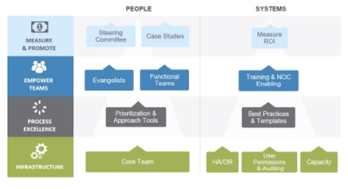

* Standardizes automation implementation.
* Holds core team accountable for prioritizing, planning and monitoring.
* Promotes best practices to assure smooth and quick development processes

### Process Automation with AI

When implementing automation, combining robotic process automation (RPA) with cognitive technologies such as ML, speech recognition, and natural language processing (NLP), can automate higher-order tasks with AI assist.

Any process can be automated as long as there is a clear operating procedure available. System architecture knowledge, process, sub-systems interfaces, interconnect logic, etc. are pivotal that will serve as a blueprint.

IGI has clarity about which solutions exist today commercially or open source. Leveraging available solutions and technology provides extra cushion to minimize the risks and enables us to achieve the target system sooner.

###  Design and Implementation Techniques

Below is the IGI’s depiction of typical end-to-end component design implementing a fully functional AI-driven automation.

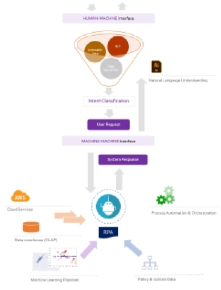

Starting from the top, we have a user interface which will allow to capture user requests. The user *intent* is understood by *classifying* into pre-defined categories using NLU pipelines. These pipelines are typically made up of several NLP libraries such as *SpaCy* or *NLTK*, providing support for word vectors/embedding in multiple languages, tokenization, etc. Another important task, which is also performed by this layer, is to extract *entity* (contextual data) form user requests. Entities are part of text that are of interest to the data scientist or the business, such as names of people, address, account numbers, locations etc. These are then passed downstream for further processing. Advanced techniques and algorithms, such as *Conditional Random Fields (CRF)* and *Stemming* are used to train the model for performing Named Entity Recognition (NER). Support for NER is available in libraries like SpaCy, which allows entity extraction by knowing their pattern and other statistical properties. Furthermore, specific piece of information, such as date and time can be extracted using libraries like *duckling*.

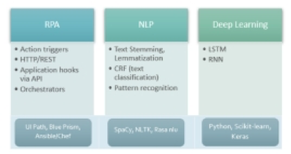

Where possible, externalizing and decoupling of control logic can yield benefits in terms of flexible design and system updates. In summary, implementing systems with an 'automation first' approach following the approach detailed above creates opportunities for enhanced user experience, boosting user trust level, gaining operational excellence and improving Return on Investment (ROI).

## Entity/Person Network and Open-Source Data

Technical Area 2 is concerned with entity/person network relationship discovery and mapping with intelligent searching across disparate open-source data sources using AI/ML models The web contains lots of information, but typically the raw data itself isn't available – rather only HTML documents constructed from data. IGI believes the semantic web seeks to change the landscape of the internet with regard this problem in a number of ways:

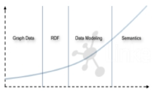

* Opening up the web of data to artificial intelligence processes.
* Encouraging businesses to use data already available on the web and also publish their data freely in an open standard format.

Our approach and key considerations for implementing the semantic web are presented below.

### Graph Data

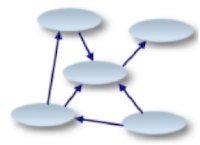

**Resource Description Framework (RDF)** forms one of the basic building blocks for forming the web of semantic data called a **graph database**. RDF defines statements comprising a **subject**, a **predicate** and an **object** relationship called a triple and offers a flexible, graph-based model for recording data that is interchangeable globally.

### Semantic Modeling and Metadata

Adding semantics to the data enables systems to branch across **domains of knowledge** automatically. Standard vocabularies, or formal ontologies representing terms within a domain of knowledge, are already available freely from various organizations: 

* Dublin Core Metadata Initiative (DCMI) – ontologies for terms in media.
* **Friend of a Friend (FOAF) – focuses on developing a standard vocabulary/ontology for social networking.**
* OpenCyc – An ontology of everyday, common sense terms.

### RDF Schema & Web Ontology Language

Both [RDFS](<https://www.w3.org/TR/rdf-schema/> "RDFS Specification") and [OWL](<https://www.w3.org/TR/owl-ref/> "OWL Specification") are W3 specifications. The primary purpose of ontology is to classify things in terms of semantics, or meaning. In OWL, this is achieved through the use of *classes* and *subclasses*, instances of which in OWL are called *individuals*. The individuals that are members of a given OWL class are called its *class extension*.

Individuals in OWL are related by *properties*. There are two types of properties in OWL:

* **Object properties** relate individuals of two OWL classes.
* **Datatype properties** relate individuals of OWL classes to literal values.

RDF extends the linking structure of the Web to use uniform resource identifiers (URIs) to name the relationship between things as well as the two ends of the link (referred to as a **“triple”**). Using this simple model allows structured and semi-structured data to be mixed, exposed, and shared across different applications.

This linking structure forms a directed, labeled graph, where the edges represent the named link between two resources, represented by the graph nodes. This graph view is the easiest possible mental model for RDF and is often used in easy-to-understand visual explanations. 

Similarly, **Friend of a Friend (FOAF)** is a machine-readable ontology describing persons, their activities and their relations to other people and objects. Anyone can use FOAF to describe themselves. FOAF allows groups of people to describe social networks without the need for a centralized database.developing

### Querying Semantic Data and SPARQL Endpoint

The triples of RDF data are queried using SPARQL (SPARQL Protocol and RDF Query Language) which is a [W3 standard](<https://www.w3.org/TR/rdf-sparql-query/> "SPARQL Standard"). SPARQL provides a formal language with which meaning-driven questions are turned into queries that return meaningful results, which is the benefit of semantic web technologies.

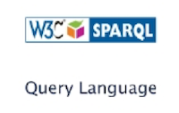

In practice, IGI can build entity/person networks in RDF using FOAF ontology across domains of
knowledge. We would use SPARQL to query and filter linked data collections across open source data, resulting in improved data discovery and intelligent searching.

## Fault Tolerant Data Connectors

Technical Area 3 is concerned fault-tolerant data connectors across disparate sources and interfaces with learning and adaptive functions. IGI has extensive experience developing and maintaining interfaces with critical Department of Defense (DoD) information systems. When discussing data sharing, our experience has shown that the majority of the communications applications assume the availability of a reliable network. Data are expected to traverse the network and to arrive intact at their destination. In reality, networks, systems and the software subject to a variety latent reliability issues. To counter this problem, IGI presents the following concepts and approach to deliver fault tolerant data connectors.

### Creating Data Pipeline

For this discussion, we present the use case of building a data pipeline for log analysis in a distributed system which supports millions of users. The application system will sometimes have spikes in user activity and the framework needs to take care of such scenarios. The create this pipeline, IGI recommends the system architecture with Logstash as forwarder, Kafka as queue, spark as analytics engine and Elasticsearch as data store.

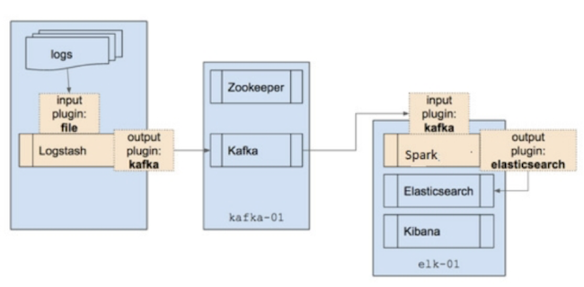

### Fault tolerance
As we will demonstrate fault tolerance is provided so that the failure of a particular module should not result in data loss.

#### Failure at Logstash
Logstash is a forwarder which sends data from log files to kafka. It has to keep track of the last line it reads to be able to forward any newly written log line.Data loss at this point can be avoided as even if logstash goes down, it has the pointer of the last line it read from the log file. Monitoring is required to detect such shutdowns.

#### Failure at Kafka

Kafka is a distributed publish-subscribe messaging system. It was originally developed at LinkedIn Corporation and later on became a part of Apache project. Kafka is a fast, scalable, distributed in nature by its design, partitioned and replicated commit log service.

**Kafka can be leveraged in fault tolerance** as Kafka can hold data for a configurable time interval. Even if pipeline ahead of kafka goes down it will have data stored in kafka queue. 
Kafka can have multiple brokers, so Zookeeper is used to keep track of active brokers and all communication to kafka should go through Zookeeper.

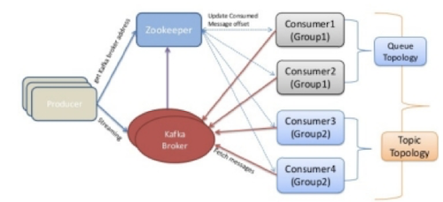

#### Failure at Spark

Spark is used for alerting and outlier detection. To provide fault tolerance, we need to implement a hot standby master node with service discovery. 

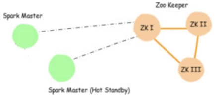

#### Failure at Elasticsearch

Elasticsearch is a distributed, multi-tenant-capable, full-text search engine. For stability and best performance of the Elasticsearch cluster, we would keep a spate node as master node. It can be done by making **“data=false”** and **“master=true”** in config file.

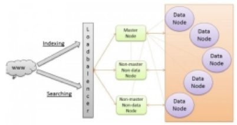

Like the above scenario, IGI can plan for the failure and implement solutions with redundancy as our key underlying approach to fault tolerance.

## Knowledge Portal

Technical Area 4 is focused on developing an adaptive, intelligent integrated domain knowledge management and discovery portal, while Technical Area 5 involves using intelligent data scraping and categorization to dynamically define data architecture, taxonomy, and profiles to use in advanced data discovery and access layers including natural language processing and analytics. With years of experience developing the Defense Acquisition University (DAU) learning portal, IGI understands that getting the right information in front of the right people at the right time is the elusive KM goal. Our key considerations for enhanced knowledge management and information discovery are presented in the following sections.

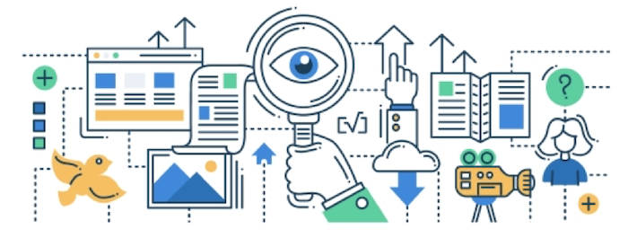

### Search & Discovery

Search-based knowledge management portals enable users to discover and retrieve information to support their business objectives. When people know what they want, they search in order to retrieve information. When they don’t know want they want, they browse in order to discover the new information. A knowledge management portal with the correct information architecture allows users to both search and browse – to retrieve and discover – changing modes back and forth in the same session. Retrieval can be followed by browsing, which can be facilitated by faceted navigation, related concept search, and knowledge graph browsing. Machine Learning based auto-tagging of content allows users to follow their line of thinking by using data relationships to locate and discover information.

### Taxonomy & Metadata

Taxonomy enables and supports both internal process such as knowledge management and externally-facing features like navigation, search and personalization. Consistent, accurate metatagged content aids users in quickly finding the content. Personalization is best enabled through the use of metatags in conjunction with KM to enable dynamically generated navigation.

### Knowledge Objects

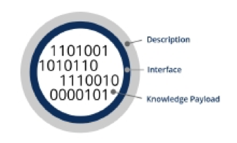

Knowledge Objects represent knowledge in a modular form. Knowledge Objects combine a knowledge payload with a detailed description and an interface. This payload is encapsulated and makes knowledge actionable include predictive models, guidelines, and decision support rules.

### Knowledge Graph

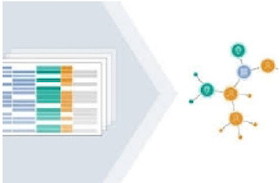

Programmatic way to model a knowledge domain with the help of subject-matter experts, data interlinking, and machine learning algorithms. Knowledge graph acquires and integrates information into an ontology and applies a reasoner to derive new knowledge.

A knowledge graph is typically built on top of the existing data collections to link all data together at web-scale both structured and unstructured information.

## System Architecture

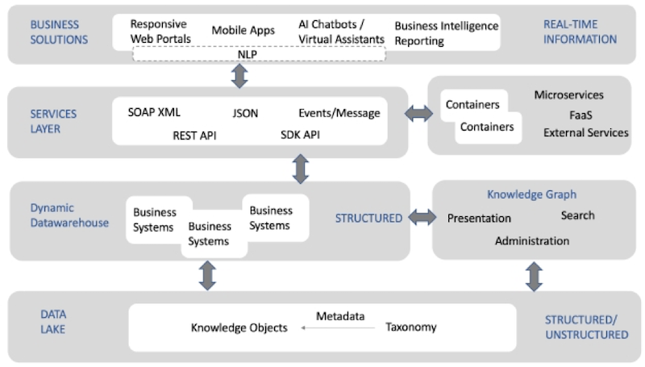

IGI brings these key considerations into the following system architecture. This architecture, when implemented, will enable adaptive, integrated domain knowledge management and drive quality and performance standards across business domains. 

## Summary

IGI has the experience, knowledge and staff to deliver AI/ML solutions to USCIS. As described above, we offer a team that can provide a wide range of solutions across the enterprise to build, enhance and support current and future systems used to meet USCIS mission requirements. 

