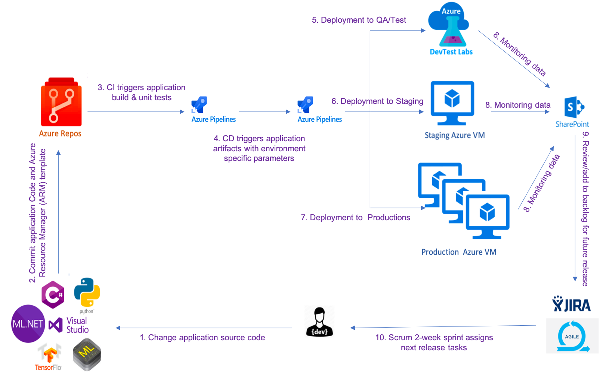

# Information Gateways Inc. (IGI)

## Response to

## X Ecosystem for Quantitative Unification of Artificial intelligence and Machine Learning (X-EQUALS)

### RFI Number: 70SBUR19I00000038

### 1 August 2019

## Technical Capability
### EXECUTIVE SUMMARY 

Information Gateways Inc. (IGI) is pleased to submit this response to the U.S. Citizenship and Immigration Services (USCIS) Office Of Information Technology Sources Sought – Request for Information (SS-RFI) under our GSA 8(a) STARS II contract, GS06F0666Z. This effort is in regard to contractor provided Artificial Intelligence and Machine Learning (AI/ML) technologies integrated with Development, Security and Operations (DevSecOps) teams.

Founded in 1997, IGI is a Top Secret cleared, small business enterprise with a technical staff of approximately 100 highly qualified professionals supported by our offices in Michigan and Virginia. Our primary service offerings include Program/Project Management, Custom Application Development/Maintenance, Infrastructure/Network support, Desktop Support, Enterprise Integration specializing in databases, data warehousing and business intelligence, and Enterprise Resource Planning. 

IGI’s service delivery and quality processes, supported by our staff and certifications, ensure our clients receive the best possible service. Our certifications include CMMI Level 3 for Development Version 1.2 of the Software Engineering Institute; ISO 9001:2015, Quality Management System (QMS); ISO 20000-1:2011 Information Technology Service Management System (ITSMS); and ISO 27001:2013, Information Security Management System (ISMS). Our processes and certifications prove our commitment to delivering excellent service to our customers.
 
### Company Information

Company Name  | Information Gateways Inc. (IGI)
------------- | -------------
Address:  | 19500 Victor Parkway, Suite 250, Livonia, MI 48152l
Point of Contact:  | David Roth, Director - Business Development, Email: droth@infogateways.com, Phone: (248) 467-8696
DUNS Number: | 17-499-9003
NAICS 541511/541512: | Small Business; Under $27.5M
Contract Vehicles: | GSA, 8(a) STARS II – GS06F0666Z, GSA IT Schedule 70 – GS-35F-0343R, ITES-3S – W52P1J-18-D-A052

### Relevant Experience 
At the Defense Acquisition University (DAU), we are part of the dau.mil development team using DevOps in an Agile environment. As a teaming partner, we are actively engaged in all aspects of DevOps. dau.mil is a web portal providing training and other online resources for users across the Department of Defense. The site is hosted in the Amazon Web Services (AWS) cloud and uses AWS Microservices,  Azure  Functions  and  Azure  Cognitive  Services. The site is programmed using a variety of programming languages, including Python,  C#,  ML.NET  and  Core  ML. Additionally, the site is built using much of the same open source technology presented in the RFI, including:

* Elasticsearch
* Git  /  Enterprise  GitHub
* Java,  Javascript
* JIRA
* Maven
* Oracle  &  PL/SQL
* Python
* AngularJS
* Spark
* sparkML
* TensorFlow

At DAU, we chose to use REST-based APIs instead of message streaming as this approach better fits the communications needs of DAU users. As a learning portal, information is best provided when requested by users. Key characteristics of this approach include:

* Request/response model — users send requests to an API server and receive a response.
* Pull-based interaction — users send an API request when data or functionality is required.
* Synchronous — users receive the response after a request is sent.
* Multiple content types — since REST APIs are built upon HTTP, responses may be JSON, XML, or other content types as necessary to support user needs.
* Flexible interactions — users may interact with REST-based APIs through resources in a variety of ways, incluidng queries/search, creating new resources, modifying existing resources, and deleting resources. 
* Caching and concurrency protocol support — HTTP has caching semantics built-in and eTags for concurrency control to prevent overwriting content.
* Internal and external access — REST APIs may be restricted for internal use or for external use by partners or public developers.
A key component of the DEVSEOPS process is Continuous Integration/Continuous Delivery (CI/CD) pipeline automation. Our CI/CD pipeline is shown in Figure 1. 
 




We have integrated a number of AI/ML platforms and capabilities in dau.mil, including:

* User feedback is routed through Microsoft Cognitive Services for Sentiment  Analysis. Also, near real-time analytics reports are generated using Power BI.

* The DAU Point & Learn app uses Microsoft Vision Framework, Core ML and Tensor Flow to train a model that uses Augmented Reality (AR Kit and AR Core) to identify the Acquisition Framework objects through mobile devices camera. This provides an actionable Acquisition resource to students and the workforce at the point of need.

* We developed Google Assistant based trivia games which use Natural  Language Processing (NLP) to enable a fun learning environment for students to validate their Acquisition skills.

* We developed Amazon Alexa custom skills which use NLP to provide the recent Acquisition News, Blogs, Events and Campus operating status using REST APIs.

## Summary

As described above, IGI has the capabilities, experience and knowledgeable staff to develop complex IT projects using the DevOps CI/CD model in an Agile environment and industry standard open source products.

---------

This Request for Information response includes data that shall not be disclosed outside the Government and shall not be duplicated, used, or disclosed in whole or in part for any purpose other than to evaluate this proposal. If, however, a Contract is awarded to this Offeror as a result of or in connection with the submission of this data, the Government shall have the right to duplicate, use, or disclose the data to the extent provided in the resulting Contract. This restriction does not limit the Government’s right to use information contained in this data if it obtained from another source without restriction. The data subject to this restriction is contained in all pages.